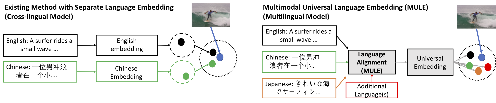

# [MULE: Multimodal Universal Language Embedding (AAAI 2020 Oral)](https://arxiv.org/pdf/1909.03493.pdf)

 This repository implements:

Donghyun Kim, Kuniaki Saito, Kate Saenko, Stan Sclaroff, Bryan A. Plummer. 

[MULE: Multimodal Universal Language Embedding. AAAI, 2020 (Oral).](https://arxiv.org/pdf/1909.03493.pdf)

Our project can be found in [here](http://cs-people.bu.edu/donhk/research/MULE.html).



## Environment
This code was tested with Python 2.7 and Tensorflow 1.2.1.

## Preparation

1. Download data
- Download data from [here](https://drive.google.com/file/d/1xYGfsDBwDyvoztXNvmO1BOM0vzv2P8Oe/view?usp=sharing)
- Unzip the file and place the data in the repo (All data files should be in ./data)

2. Download FastText

- `sh fetch_fasttext_embeddings.sh`


## Training and Testing
  ```Shell
  ./run_mule.sh [MODE] [GPU_ID] [DATASET] [TAG] [EPOCH]
  # MODE {train, test, val} which indicates if you want to train the model or evaluate it using test or val splits
  # GPU_ID is the GPU you want to test on
  # DATASET {multi30k, coco} is defined in run_mule.sh
  # TAG is an experiment name
  # EPOCH optional, epoch number to test, if not provided, best model on validation data is used
  # Examples:
  ./run_mule.sh train 0 multi30k mule
  ./run_mule.sh train 1 coco mule
  ./run_mule.sh test 1 coco mule
  ./run_mule.sh val 0 multi30k mule 20
  ```
  
By default, trained networks are saved under:

```
models/[NET]/[DATASET]/{TAG}/
```

### Citation
If you find our code useful please consider citing:

    @inproceedings{kimMULEAAAI2020,
      title={{MULE: Multimodal Universal Language Embedding}},
      author={Donghyun Kim and Kuniaki Saito and Kate Saenko and Stan Sclaroff and Bryan A. Plummer},
      booktitle={AAAI Conference on Artificial Intelligence},
      year={2020}
    }
